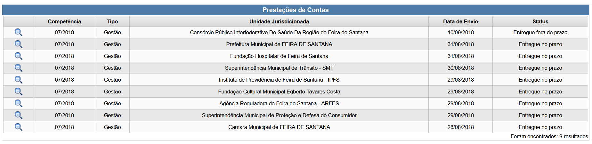
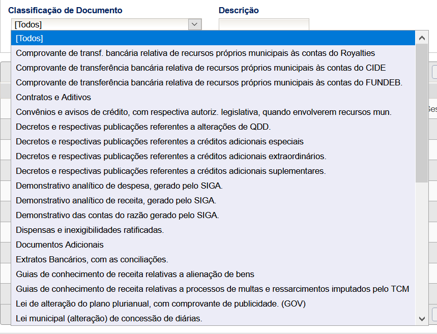

# documentos-tcmba

O Tribunal de Contas dos Municípios da Bahia tem uma
[consulta pública](https://e.tcm.ba.gov.br/epp/ConsultaPublica/listView.seam)
para todos os documentos submetidos pelas prefeituras através do SIGA.

Infelizmente esses dados não estão disponíveis para download em massa
ou em formato aberto. Nós queremos libertar esses dados. Dessa forma,
qualquer cidadão poderá ter acesso a prestação de contas feita por qualquer
município no estado da Bahia.

Os municípios podem submeter esses dados até 40 dias depois do final do mês.

Esse repositório está sujeito ao código de conduta e guia de contribuição
do Dados Abertos de Feira disponíveis [aqui](https://github.com/DadosAbertosDeFeira/guias).

## Passo a passo para acesso aos documentos

### Passo 1: filtros

Para carregar a tabela "Prestações de Contas" você precisa selecionar alguns filtros:

* **Periodicidade PCO**:
    - Anual
    - Mensal
* **Competência**: filtro de mês ou ano
* **Tipo**: pode deixar em branco (?)
* **Munícipio**: Feira de Santana (podemos pensar em criar um pacote para raspar por município, assim outras cidades podem se beneficiar da solução)
* **Unidade Jurisdicionada**: todas (teremos que selecionar uma por uma no próximo passo)
* **Status**: pode deixar em branco (esperamos que venham todas)

### Passo 2: Prestações de Contas

Aqui irão aparecer os resultados das opções selecionadas no Passo 1.
Geralmente uma lista com as unidades jurisdicionadas e a competência (mês/ano).

### Passo 3: Resultados

Ao clicar em uma unidade jurisdicionada (do passo anterior), temos acesso a lista de
documentos, paginada a cada 10 resultados:

É interessante utilizar os filtros para coletar a categoria de um grupo de documentos:

Essas categorias não estão disponíveis na tabela de resultados mas são interessantes
como filtros para o cidadão.

## Desenvolvimento

TODO

---

Outras informações:

- Competência (período) mais antigo: 10/2015

Demandas técnicas:

- Cuidado com o número de acessos para não sobrecarregar o portal
- Importante guardar as "migalhas" de dados, como filtros selecionados.
Assim poderemos enriquecer esses dados mais tarde e facilitar a busca/filtragem.
